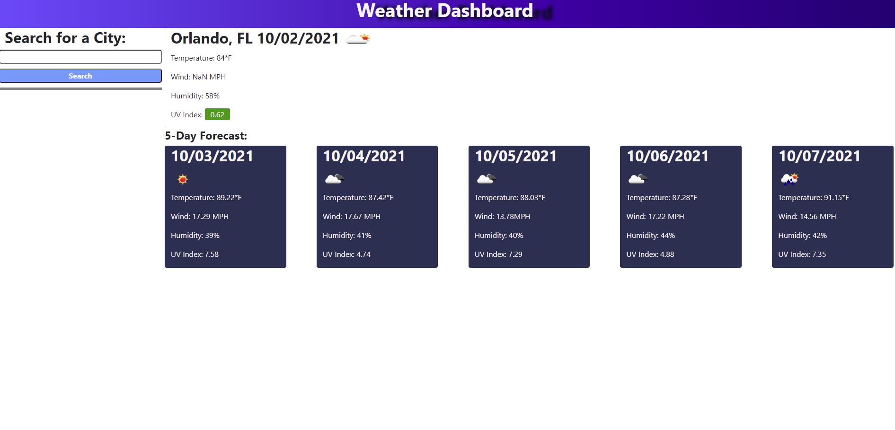

# **Zichko's Weather Dashboard**

_Click the image to visit the page._

## Description
This is a weather dashboard that uses [OpenWeather One Call API](https://openweathermap.org/api/one-call-api) to display the weather data for the region entered into the search bar. 

## How to Use
Enter a `city`, `zipcode`, or `city, state(full state name)`.

Now you have relevant weather data from that specific region. After your first search you should notice a grey button that has the region you entered. If you click this button it will pull up the relevant weather data for that area and a new button will appear to make it the most recent search. 